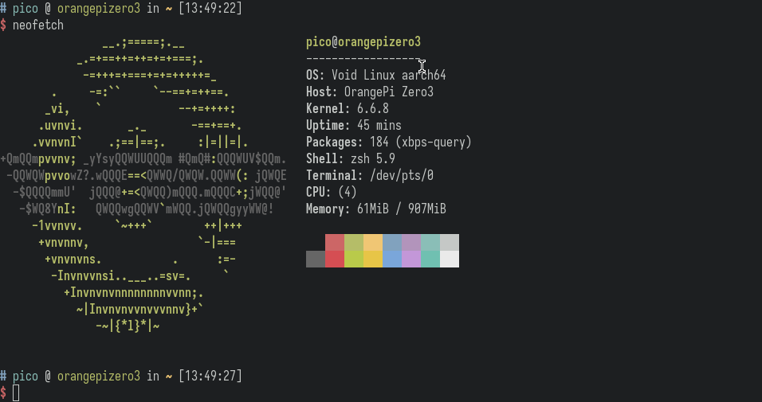

# Orange Pi Zero 3

This list is a collection of tools, projects, images and resources.

You can find other resources [here](https://share.osaigon.com/sbc/opi-zero3). I'm hosting it at home.

Vietnamese only: hỗ trợ bằng Tiếng Việt từ xa hoặc tận nơi ở SG.

## Content

- [Specification](#specification)
- [OS Images](#os-images)
- [Tools](#tools)
- [Tutorials](#tutorials)
- [Resources](#resources)
- [Things can do](#things-can-do)

## Specification

| | |
| --- | --- |
| CPU | Allwinner H618 Quad-core Cortex-A53 processor 1.5GHz |
| GPU | • Mali G31 MP2 • Supports OpenGL ES 1.0/2.0/3.2, OpenCL 2.0, Vulkan 1.1 |
| Memory | 1GB/1.5GB/2GB/4GB LPDDR4 |
| On-board storage | 16MB SPI Flash |
| Power management | AXP313A |
| On-board WiFi + Bluetooth | Supports WiFi5 and Bluetooth 5.0 |
| Network | 10M/100M/1000M Ethernet interface |
| Audio input/output | 13Pin expansion port supports 2-ch output 1-ch input |
| Video output | • Micro HDMI up to 4K@60fps • TV-Out:13Pin supports 1-ch TV CVBS output |
| UART | 3Pin Debug UART |
| USB | USB 2.0 * 3(two of which lead from the expansion board) |
| SD card interface | Micro SD card interface |
| Expansion interface | • 26Pin GPIO interface • 13Pin GPIO interface |
| Power input | 5V3A，Type-c connector |
| OS Support | Android 12 TV，Debian11，Debian12，Ubuntu22.04，Ubuntu20.04 |
| PCB | 50mm * 55mm |

## OS Images

For more information you can go [here](https://pico.io.vn/2023/12/27/operating-systems-you-can-run-on-orange-pi-zero-3).

### Official

You can check on The Official Website [here](http://www.orangepi.org/html/hardWare/computerAndMicrocontrollers/service-and-support/Orange-Pi-Zero-3.html).

- [Android](https://drive.google.com/drive/folders/1s3q8Hj07efRS7fXnPivseXK63V_y_EjM?usp=shar) - The platform changing what mobile can do.
- [Debian](https://drive.google.com/drive/folders/1g2o209HE9_28v7wIXdq0tf5jOTTJdpVb?usp=shar) - A complete Free Operating System.
- [Orange Pi OS](https://drive.google.com/drive/folders/1oRNJLAbbvtbAjXdmsokZbYOyzed4HsQm?usp=sharing) - The officially supported open source operating system for Orange Pi.
- [OpenWrt](https://drive.google.com/drive/folders/1IKYEIGmJ-5js7SpndM-pEd7xOs5_e5CA?usp=sharing) - A Linux operating system targeting embedded devices.
- [Ubuntu](https://drive.google.com/drive/folders/1aLTaOlIMdHhwk3oeZY2YPdB9T8U-EAKA?usp=shar) - The modern, open source operating system on Linux for the enterprise server, desktop, cloud, and IoT.

> Remark: Android image can only burn by PhoenixCard, and for Windows only, there is [OpenixCard](https://github.com/YuzukiTsuru/OpenixCard) for Linux but I'm not sure.

### madebyme

- [Void]() - no longer availabe because I think Debian / Ubuntu is good enough.

### 3rdparty

- [Armbian](https://www.armbian.com/orange-pi-zero-3) - Linux for ARM development boards (Ubuntu / Debian base).
- [DietPi](https://dietpi.com/downloads/images/DietPi_OrangePiZero3-ARMv8-Bookworm.img.xz) - Highly optimised minimal Debian OS.

## Tools

- [Buildroot](https://buildroot.org) - A tool to generate embedded Linux systems through cross-compilation.
- [Yocto Project](https://www.yoctoproject.org) - Create custom Linux-based systems regardless of the hardware architecture.
- [Orange Pi wiringPi](https://github.com/orangepi-xunlong/wiringOP)
- [Orange Pi wiringOP for Python](https://github.com/orangepi-xunlong/wiringOP-Python)
- [PiShrink](https://github.com/Drewsif/PiShrink) - Make your pi images smaller!

## Tutorials

- [Sunxi Manual build howto](https://linux-sunxi.org/Manual_build_howto)
- [Sunxi Mainline Kernel Howto](https://linux-sunxi.org/Mainline_Kernel_Howto)
- [Sunxi U-Boot](https://linux-sunxi.org/U-Boot)
- [Sunxi Bootable SD card](https://linux-sunxi.org/Bootable_SD_card)

## Resources

- [The Linux kernel](https://www.kernel.org) - A monolithic, modular, multitasking, Unix-like operating system kernel.
- [u-boot](https://source.denx.de/u-boot/u-boot) - A boot loader for Embedded boards.
- [Orange Pi Linux Kernel](https://github.com/orangepi-xunlong/linux-orangepi)
- [Orange Pi U-Boot](https://github.com/orangepi-xunlong/u-boot-orangepi)
- [Orange Pi Firmware](https://github.com/orangepi-xunlong/firmware)
- [u-boot-sunxi-with-spl.bin](u-boot)

## Things can do

Since Orange Pi Zero3 has Cortex-A53 that is an ARMv8 CPU, it support AArch64 (ARM64).

There are many programs can run on ARM64, they made docker images for arm64 too.

Just look for name of the executable file, it may contain: arm64, armv8, aarch64.

In my experience, Orange Pi Zero3 can run many programs just like Raspberry Pi 3 which has same CPU implementing. You may expect some features don't fully work (e.g GPIO) because Orange Pi support is simply not the same level as Raspberry.

After all, I definitely recommend this board. It worth the money.