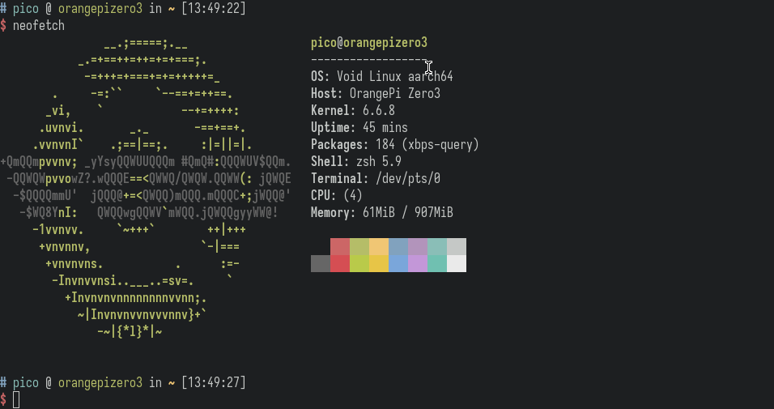

# Orange Pi Zero 3

This list is a collection of tools, projects, images and resources.

You can find other resources [here](https://file.pico.io.vn/single-board-computer/opi-zero3). I'm hosting it at home.

Vietnamese only: hỗ trợ bằng Tiếng Việt từ xa hoặc tận nơi ở SG.

## Contents

- [OS Images](#os-images)
- [Tools](#tools)
- [Tutorials](#tutorials)
- [Resources](#resources)

## OS Images

For more information you can go [here](https://pico.io.vn/2023/12/27/operating-systems-you-can-run-on-orange-pi-zero-3).

### Official

- [Android](https://drive.google.com/drive/folders/1s3q8Hj07efRS7fXnPivseXK63V_y_EjM?usp=shar) - The platform changing what mobile can do.
- [Debian](https://drive.google.com/drive/folders/1g2o209HE9_28v7wIXdq0tf5jOTTJdpVb?usp=shar) - A complete Free Operating System.
- [Orange Pi OS](https://drive.google.com/drive/folders/1oRNJLAbbvtbAjXdmsokZbYOyzed4HsQm?usp=sharing) - The officially supported open source operating system for Orange Pi.
- [OpenWrt](https://drive.google.com/drive/folders/1IKYEIGmJ-5js7SpndM-pEd7xOs5_e5CA?usp=sharing) - A Linux operating system targeting embedded devices.
- [Ubuntu](https://drive.google.com/drive/folders/1aLTaOlIMdHhwk3oeZY2YPdB9T8U-EAKA?usp=shar) - The modern, open source operating system on Linux for the enterprise server, desktop, cloud, and IoT.

### madebyme

- [Void](void) - An independent Linux distribution that uses the XBPS package manager, and the runit init system.

### 3rdparty

- [Armbian](https://www.armbian.com)
    - [armbian_build](https://github.com/armbian/build) - Armbian Linux Build Framework (WIP).
    - [armbian-images](https://github.com/leeboby/armbian-images) - images and u-boot only.
- [DietPi](https://dietpi.com) - Highly optimised minimal Debian OS (WIP).
    - [testing](https://dietpi.com/downloads/images/testing) - Testing (WIP).
- [Fedora](https://github.com/lalakii/fedora_39_minimal_orangepizero3) - A Linux distribution developed by the Fedora Project.
- [Kali Linux](https://github.com/leeboby/kali-images) - An Advanced Penetration Testing Linux distribution used for Penetration Testing, Ethical Hacking and network security assessments.
- [Raspberry Pi OS](https://github.com/leeboby/raspberry-pi-os-images) - A free operating system based on Debian, optimised for the Raspberry Pi hardware.

## Tools

- [Buildroot](https://buildroot.org) - A tool to generate embedded Linux systems through cross-compilation.
- [Yocto Project](https://www.yoctoproject.org) - Create custom Linux-based systems regardless of the hardware architecture.
- [Orange Pi wiringPi](https://github.com/orangepi-xunlong/wiringOP)
- [Orange Pi wiringOP for Python](https://github.com/orangepi-xunlong/wiringOP-Python)
- [PiShrink](https://github.com/Drewsif/PiShrink) - Make your pi images smaller!

### Tutorials

- [Sunxi Manual build howto](https://linux-sunxi.org/Manual_build_howto)
- [Sunxi Mainline Kernel Howto](https://linux-sunxi.org/Mainline_Kernel_Howto)
- [Sunxi U-Boot](https://linux-sunxi.org/U-Boot)
- [Sunxi Bootable SD card](https://linux-sunxi.org/Bootable_SD_card)

## Resources

- [The Linux kernel](https://www.kernel.org) - A monolithic, modular, multitasking, Unix-like operating system kernel.
- [u-boot](https://source.denx.de/u-boot/u-boot) - A boot loader for Embedded boards.
- [Orange Pi Linux Kernel](https://github.com/orangepi-xunlong/linux-orangepi)
- [Orange Pi U-Boot](https://github.com/orangepi-xunlong/u-boot-orangepi)
- [Orange Pi Firmware](https://github.com/orangepi-xunlong/firmware)
- [u-boot-sunxi-with-spl.bin](u-boot)